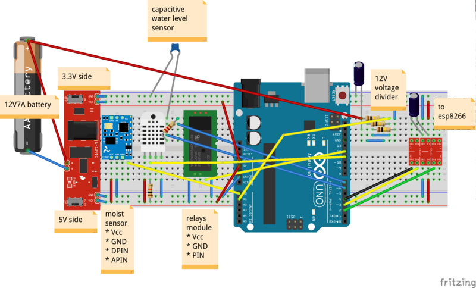

My Balcony Project
----

Getting lots of sun, and very little precipitation, two days without watering,
and my plants on the balcony are dead. Long weekends, never mind holidays,
disastrous. So lets water them automatically.

There is a large bucket of water on the floor.

Hanging at about 2 meters is a plastic balcony plant holder. I selected it for
having only one drain hole. Replaced the hole with a tube outlet. From there
there is tubing to my plants. Plants are at 1 meter height or on the floor.
Once water is in this "bucket" gravity takes care of the rest.

There is a water pump in the bottom bucket, and a hose running to the high
bucket.

I have a 12V 7Amp battery, hooked up to a solar panel. There is a water pump
connected to it via a relays. There is an arduino that can switch the relays.

The arduino is connected to:

1. a relays
2. a moist sensor (in the high bucket)
3. a capacitive water level sensor (in the main bucket)
4. a temerature sensor
5. an esp8266 wifi module
6. a voltage divider sensing battery level

The arduino reports its sensors via the esp8266, and receives the time. Every
morning it will pump at 10:15 until the high bucket is full.

TODO
----

* replace sensor in top bucket (maybe)
* allow setting amount (duration) of water to be pumped, perhaps temperature based etc.
* work on server and interface, to allow more control

Schematic
----

